# SecurityGate

Orquestador central de **Cerberus**, una plataforma DevSecOps sobre Kubernetes que automatiza el análisis de seguridad y calidad del ciclo de desarrollo. SecurityGate recibe las solicitudes de escaneo, las publica en RabbitMQ para que los flujos de n8n disparen las herramientas de análisis, y recibe de vuelta los resultados normalizados para persistirlos.

Construido en **.NET 8**, persiste en **PostgreSQL** y se comunica con el resto de servicios vía **RabbitMQ**, siguiendo los contratos congelados `v1.0.0` del repositorio `cerberus-contracts`.

---

## Rol en la plataforma

SecurityGate es la puerta de entrada del pipeline. Un cliente (o el CI) solicita un escaneo, SecurityGate lo registra y lo despacha, y al final consolida los resultados que devuelven los servicios de análisis.

```mermaid
flowchart LR
    Client([Cliente / CI]) -->|POST /api/scan/request| SG[SecurityGate]
    SG -->|persiste| DB[(PostgreSQL)]
    SG -->|publica scan-request| MQ{{RabbitMQ<br/>cerberus.scan.requests}}
    MQ --> N8N[n8n]
    N8N -->|ejecuta| Tools[Semgrep / Trivy / ZAP / Gitleaks]
    Tools --> Analyzers[VulnerabilityService<br/>CodeQuality]
    Analyzers -->|POST /api/scan/webhook/result<br/>scan-result| SG
    SG -->|persiste resultados + findings| DB
    Client -->|GET /api/scan/&#123;id&#125;/status| SG
```



---

## Stack técnico

| Componente | Tecnología |
|---|---|
| Runtime | .NET 8 (ASP.NET Core Web API) |
| Base de datos | PostgreSQL (acceso vía Npgsql + Entity Framework Core) |
| Mensajería | RabbitMQ (RabbitMQ.Client 7.2.1) |
| Documentación API | Swagger / Swashbuckle |
| Contenedor | Docker (multistage) |

---

## Endpoints

| Método | Ruta | Descripción |
|---|---|---|
| `GET` | `/api/health` | Liveness probe. Devuelve `{ status: "healthy" }`. |
| `GET` | `/api/ready` | Readiness probe. |
| `POST` | `/api/scan/request` | Crea una solicitud de escaneo, la persiste y publica el `scan-request` en RabbitMQ. Devuelve `201` con el `scanId`. **Protegido con rate limiting.** |
| `GET` | `/api/scan/{id}/status` | Consulta el estado de un escaneo: `pending`, `running` o `completed`. Devuelve `404` si el `scanId` no existe. |
| `POST` | `/api/scan/webhook/result` | Recibe el `scan-result` que devuelve n8n tras ejecutar una herramienta. Persiste el resultado y sus findings. **Protegido con token interno.** |

### Ejemplo — crear un escaneo

```http
POST /api/scan/request
Content-Type: application/json

{
  "repositoryUrl": "https://github.com/usuario/repositorio",
  "branch": "main",
  "commitHash": "0123456789abcdef0123456789abcdef01234567",
  "requestedAt": "2026-06-28T12:00:00Z"
}
```

Respuesta `201 Created`:

```json
{
  "scanId": "b782e4d3-...",
  "status": "pending"
}
```

---

## Contratos

SecurityGate respeta los esquemas congelados `v1.0.0` definidos en `cerberus-contracts/schemas/v1/`.

**Publica:**
- `scan-request` → al exchange fanout `cerberus.scan.requests`. Se emite cuando se crea una nueva solicitud de escaneo.

**Consume:**
- `scan-result` → vía el webhook `POST /api/scan/webhook/result`. Lo entrega n8n tras la ejecución de cada herramienta de análisis. Incluye el estado del escaneo y la lista de findings.

> El contrato `scan-verdict` lo emite QualityGate, no SecurityGate.

---

## Seguridad

- **Rate limiting** — `POST /api/scan/request` está limitado a **10 peticiones por minuto por IP** (rate limiter nativo de .NET 8). Al excederse responde `429 Too Many Requests` con el header `Retry-After`.
- **Validación anti-SSRF** — el `repositoryUrl` se valida para rechazar destinos internos o privados (localhost, loopback, rangos privados `10.x` / `172.16-31.x` / `192.168.x`, metadatos de nube `169.254.169.254`, y direcciones IPv6 reservadas), además del patrón que ya restringe la URL a GitHub.
- **Autenticación del webhook** — `POST /api/scan/webhook/result` exige el header `X-Internal-Token`. Sin él, o con un valor incorrecto, responde `401 Unauthorized`.
- **Credenciales fuera del repositorio** — `appsettings.json` contiene solo placeholders. Los valores reales viven en `appsettings.Development.json` (ignorado por git) o en variables de entorno / secretos de Kubernetes.

---

## Variables de entorno

La configuración se lee de `appsettings.json` (placeholders) y se sobreescribe con `appsettings.Development.json` en local, o con variables de entorno en despliegue.

| Clave de configuración | Descripción |
|---|---|
| `ConnectionStrings:Default` | Cadena de conexión a PostgreSQL (host, puerto, base de datos, usuario, contraseña, schema). |
| `RabbitMQ:Host` | Host del broker RabbitMQ. |
| `RabbitMQ:Port` | Puerto de RabbitMQ (por defecto `5672`). |
| `RabbitMQ:User` | Usuario de RabbitMQ. |
| `RabbitMQ:Password` | Contraseña de RabbitMQ. |
| `Webhook:InternalToken` | Token compartido que valida el webhook de resultados (`X-Internal-Token`). |

---

## Cómo ejecutarlo

### Requisitos

- .NET 8 SDK
- Acceso a una instancia de PostgreSQL con el schema de Cerberus
- Acceso a un broker RabbitMQ (para el despliegue completo del pipeline)

### Local

1. Clona el repositorio y entra a la carpeta:

   ```bash
   git clone https://github.com/Cerberus-Riwi/cerberus-securitygate.git
   cd cerberus-securitygate
   ```

2. Crea `appsettings.Development.json` con tus valores reales (este archivo está en `.gitignore`):

   ```json
   {
     "ConnectionStrings": {
       "Default": "Host=...;Port=5432;Database=cerberus;Username=...;Password=...;Search Path=cerberus"
     },
     "RabbitMQ": {
       "Host": "...",
       "Port": "5672",
       "User": "...",
       "Password": "..."
     },
     "Webhook": {
       "InternalToken": "..."
     }
   }
   ```

3. Restaura y ejecuta:

   ```bash
   dotnet restore
   dotnet run
   ```

El servicio queda disponible en `http://localhost:5202`. La documentación interactiva de Swagger está en `http://localhost:5202/swagger` (en entorno de desarrollo).

### Docker

```bash
docker build -t cerberus-securitygate .
docker run -p 5202:8080 cerberus-securitygate
```

---

## Estructura del proyecto

```
cerberus-securitygate/
├── Controllers/
│   └── ScanController.cs          # Endpoints de escaneo, status y webhook
├── Services/
│   ├── ScanRequestService.cs      # Crea y persiste solicitudes de escaneo
│   ├── ScanRequestPublisher.cs    # Publica scan-request en RabbitMQ
│   ├── ScanStatusService.cs       # Calcula el estado de un escaneo
│   ├── WebhookService.cs          # Procesa y persiste los scan-result entrantes
│   └── UrlSafetyValidator.cs      # Validación anti-SSRF de URLs
├── Models/
│   ├── ScanRequest.cs
│   ├── ScanResult.cs
│   └── Finding.cs
├── DTOs/
│   ├── CreateScanRequestDto.cs
│   ├── ScanRequestResponseDto.cs
│   ├── ScanStatusResponseDto.cs
│   └── WebhookScanResultDto.cs
├── Data/
│   └── CerberusDbContext.cs       # DbContext de Entity Framework Core
├── Program.cs                     # Configuración, DI, rate limiter y pipeline
├── appsettings.json               # Placeholders (versionado)
├── appsettings.Development.json   # Valores reales (ignorado por git)
└── Dockerfile
```

---

## Parte de

[Cerberus](https://github.com/Cerberus-Riwi) — Plataforma DevSecOps. Repositorios relacionados: `cerberus-contracts`, `cerberus-vulnerability`, `cerberus-codequality`, `cerberus-qualitygate`, `cerberus-ml`, `cerberus-k8s`.